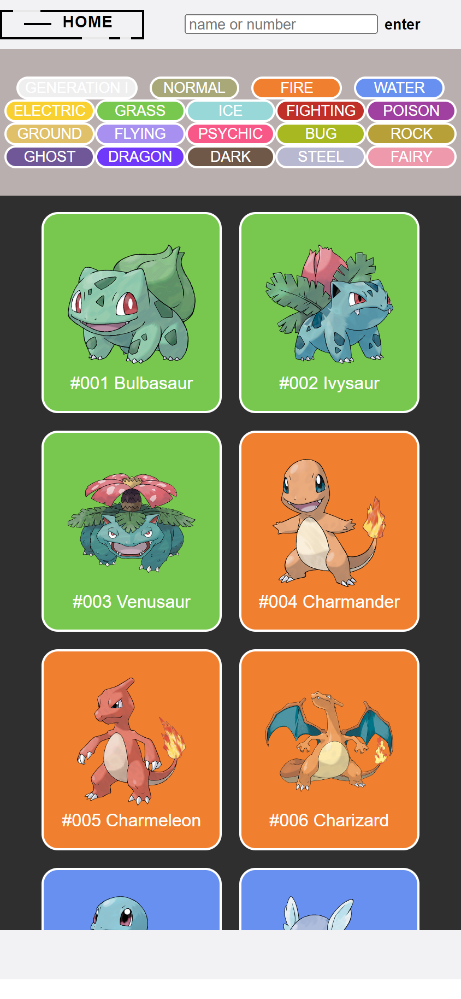
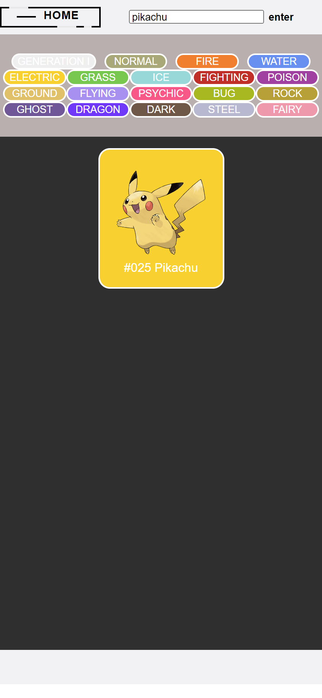
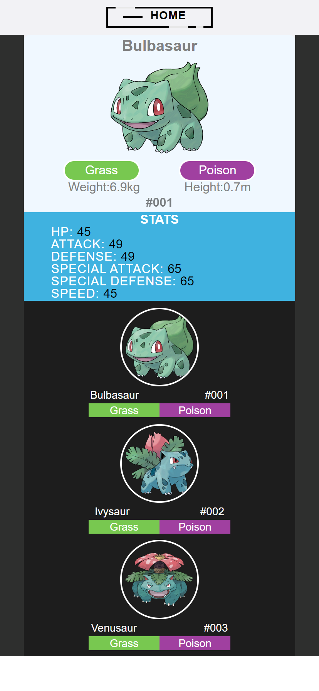

# PokeDex []

## Description

The Pokédex project is a web application developed using HTML, CSS, and JavaScript, aiming to replicate the functionality of the iconic device from the Pokémon series. The user interface, designed with HTML and styled using CSS, mirrors the sleek and intuitive design of the original Pokédex. JavaScript brings life to the application by enabling dynamic functionalities such as searching, sorting, and displaying detailed information about different Pokémon species. Through AJAX requests, it fetches data from an API like PokeAPI, allowing users to access comprehensive details on various Pokémon, including their id, types, stats, and evolutions. The project offers an interactive experience where users can explore and learn about different Pokémon, navigating through entries with ease, just like a real Pokédex.

## URL

https://pokedex-andyanza.vercel.app

## Table of Contents

- [Installation](#installation)
- [Usage](#usage)
- [License](#license)
- [Questions](#questions)

## Installation

git clone

## Usage

N/A

## License

[]

## Questions

Github: andyanza
